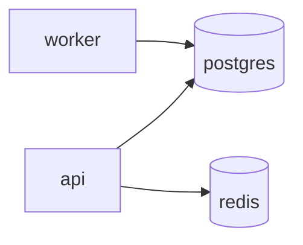

# System map
<!-- keeldocs: id=sys.map recipe=system-map@1 binds=fact:services-topology/*,fact:workspace-layout/* hash-kind=fact -->

<!-- keeldocs:slot id=sys.overview binds=fact:services-topology/*,fact:workspace-layout/* max-words=120 -->
<!-- /keeldocs:slot -->

## Services
<!-- keeldocs:gen id=sys.map.diagram binds=fact:services-topology/* hash=h1:ca7481d72e23bfa4 content=h1:296d62f5b77951c7 -->

<!-- /keeldocs:gen -->

<!-- keeldocs:gen id=sys.map.services binds=fact:services-topology/* hash=h1:ca7481d72e23bfa4 content=h1:d26a8e41a2d0fc06 -->
| service | kind | image | build | ports | depends on |
|---|---|---|---|---|---|
| `api` | owned | `compose-scenario/api` | `./packages/api` | 8080:8080 | postgres, redis |
| `postgres` | external | `postgres:${PG_TAG}` | - | 5432:5432 | - |
| `redis` | external | `redis:7-alpine` | - | - | - |
| `worker` | owned | - | `./packages/worker` | 9091:9090 | postgres |
<!-- /keeldocs:gen -->

## Packages
<!-- keeldocs:gen id=sys.map.packages binds=fact:workspace-layout/* hash=h1:e3c6f357b36d302b content=h1:46a2490cc1d04d4f -->
| package | path | manager |
|---|---|---|
| `@compose/api` | `packages/api` | npm-yarn |
| `@compose/worker` | `packages/worker` | npm-yarn |
<!-- /keeldocs:gen -->

<!-- Human notes below this line are never touched by keeldocs. -->
