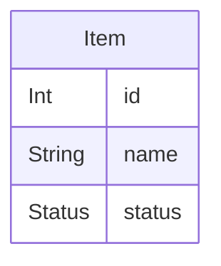

# Data model
<!-- keeldocs: id=db.root recipe=erd@1 binds=fact:db-schema/* hash-kind=fact -->

## Diagram
<!-- keeldocs:gen id=db.root.diagram hash=h1:6bab4b5bd95d86a6 content=h1:f57b958a6d65d469 -->

<!-- /keeldocs:gen -->

## Item
<!-- keeldocs: id=db.item recipe=erd@1 binds=fact:db-schema/Item hash-kind=fact -->

<!-- keeldocs:gen id=db.item.columns hash=h1:e2ad3093ccaf349e content=h1:7ca3a091c20fcd3a -->
| column | type | attributes |
|---|---|---|
| id | Int | @id @default(autoincrement()) |
| name | String |  |
| status | Status | @default(ACTIVE) |
<!-- /keeldocs:gen -->

## Enums
<!-- keeldocs:gen id=db.enums binds=fact:db-schema/enum.Status hash=h1:29c741cab60ef1c7 content=h1:d0eec7b7d834739b -->
- `Status`: ACTIVE, ARCHIVED
<!-- /keeldocs:gen -->

<!-- Human notes below this line are never touched by keeldocs. -->
