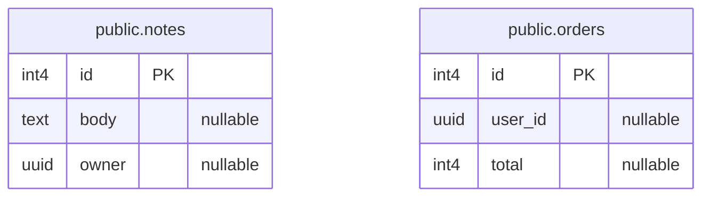

# Data model
<!-- keeldocs: id=db.root recipe=erd@1 binds=fact:db-schema/* hash-kind=fact -->

<!-- keeldocs:slot id=db.overview binds=fact:db-schema/* max-words=120 -->
<!-- /keeldocs:slot -->

## Diagram
<!-- keeldocs:gen id=db.root.diagram hash=h1:da0e658b6f6ea1bc content=h1:e5693182ad8e3b8c -->

<!-- /keeldocs:gen -->

## public.notes
<!-- keeldocs: id=db.public.notes recipe=erd@1 binds=fact:db-schema/public.notes hash-kind=fact -->

<!-- keeldocs:gen id=db.public.notes.columns hash=h1:e1b235a6b4ef0973 content=h1:1f30a7fd5d890163 -->
| column | type | attributes |
|---|---|---|
| id | int4 | primary key, default nextval('notes_id_seq'::regclass) |
| body | text? |  |
| owner | uuid? |  |
<!-- /keeldocs:gen -->

## public.orders
<!-- keeldocs: id=db.public.orders recipe=erd@1 binds=fact:db-schema/public.orders hash-kind=fact -->

<!-- keeldocs:gen id=db.public.orders.columns hash=h1:eeba8aa281ab263e content=h1:352fc5c79b85ed54 -->
| column | type | attributes |
|---|---|---|
| id | int4 | primary key, default nextval('orders_id_seq'::regclass) |
| user_id | uuid? |  |
| total | int4? |  |
<!-- /keeldocs:gen -->

## Access control (RLS)
<!-- keeldocs:gen id=db.policies binds=fact:db-policies/* hash=h1:00e9deb6749eb2d2 content=h1:1b243f3d4bf7e6f5 -->
| table | policy | command | mode | roles | using | with check |
|---|---|---|---|---|---|---|
| `public.notes` | `notes_admin_read` | SELECT | permissive | admin, service_role | `true` | - |
| `public.notes` | `notes_owner_rw` | ALL | permissive | authenticated | `auth.uid() = owner` | `auth.uid() = owner` |
| `public.orders` | `orders_select_own` | SELECT | permissive | authenticated | `auth.uid() = user_id` | - |

- RLS enabled on `public.notes`
- RLS enabled on `public.orders`
<!-- /keeldocs:gen -->

<!-- Human notes below this line are never touched by keeldocs. -->
