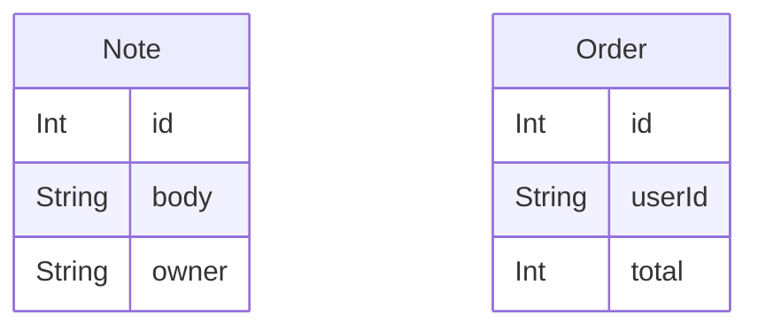

# Data model
<!-- keeldocs: id=db.root recipe=erd@1 binds=fact:db-schema/* hash-kind=fact -->

<!-- keeldocs:slot id=db.overview binds=fact:db-schema/* max-words=120 -->
<!-- /keeldocs:slot -->

## Diagram
<!-- keeldocs:gen id=db.root.diagram hash=h1:019c5f68c19f467f content=h1:e3c12c8857432a70 -->

<!-- /keeldocs:gen -->

## Note
<!-- keeldocs: id=db.note recipe=erd@1 binds=fact:db-schema/Note hash-kind=fact -->

<!-- keeldocs:gen id=db.note.columns hash=h1:25183e65302c6ebe content=h1:01a36808d9a13d7f -->
| column | type | attributes |
|---|---|---|
| id | Int | @id @default(autoincrement()) |
| body | String |  |
| owner | String |  |
<!-- /keeldocs:gen -->

## Order
<!-- keeldocs: id=db.order recipe=erd@1 binds=fact:db-schema/Order hash-kind=fact -->

<!-- keeldocs:gen id=db.order.columns hash=h1:a6b0468a35368064 content=h1:a98c845cd6f4b088 -->
| column | type | attributes |
|---|---|---|
| id | Int | @id @default(autoincrement()) |
| userId | String |  |
| total | Int |  |
<!-- /keeldocs:gen -->

## Access control (RLS)
<!-- keeldocs:gen id=db.policies binds=fact:db-policies/* hash=h1:00e9deb6749eb2d2 content=h1:1b243f3d4bf7e6f5 -->
| table | policy | command | mode | roles | using | with check |
|---|---|---|---|---|---|---|
| `public.notes` | `notes_admin_read` | SELECT | permissive | admin, service_role | `true` | - |
| `public.notes` | `notes_owner_rw` | ALL | permissive | authenticated | `auth.uid() = owner` | `auth.uid() = owner` |
| `public.orders` | `orders_select_own` | SELECT | permissive | authenticated | `auth.uid() = user_id` | - |

- RLS enabled on `public.notes`
- RLS enabled on `public.orders`
<!-- /keeldocs:gen -->

<!-- Human notes below this line are never touched by keeldocs. -->
